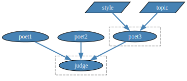

# LLM::Graph

Raku package used to efficiently schedule and combine multiple LLM generation steps.

-----

## Installation

Package installations from both sources use [zef installer](https://github.com/ugexe/zef)
(which should be bundled with the "standard" Rakudo installation file.)

To install the package from [Zef ecosystem](https://raku.land/) use the shell command:

```
zef install LLM::Graph
```

To install the package from the GitHub repository use the shell command:

```
zef install https://github.com/antononcube/Raku-LLM-Graph.git
```

-----

## Usage examples

### Three poets

Make an LLM graph with three different poets, and a judge that selects the best of the poet-generated poems:

```raku
use LLM::Graph;
use Graph;

my %rules =
        poet1 => "Write a short poem about summer.",
        poet2 => "Write a haiku about winter.",
        poet3 => sub ($topic, $style) {
            "Write a poem about $topic in the $style style."
        },
        judge => sub ($poet1, $poet2, $poet3) {
            [
                "Choose the composition you think is best among these:\n\n",
                "1) Poem1: $poet1",
                "2) Poem2: $poet2",
                "3) Poem3: $poet3",
                "and copy it:"
            ].join("\n\n")
        };

my $gBestPoem = LLM::Graph.new(%rules);
```
```
# LLM::Graph(size => 4, nodes => judge, poet1, poet2, poet3)
```

Full calculation:

```raku
$gBestPoem.eval(topic => 'hockey', style => 'limerick');
```
```
# LLM::Graph(size => 4, nodes => judge, poet1, poet2, poet3)
```

Computations dependency graph:

```raku, eval=FALSE
$gBestPoem.graph.dot(engine => 'dot', node-shape => 'ellipse', node-width => 1.2 ):svg
```




The result by the terminal node("judge"):

```raku
say $gBestPoem.rules<judge>;
```
```
# {eval-function => sub { }, input => [poet2 poet3 poet1], result => I think the best composition among these is Poem1 for its vivid imagery and rhythmic flow:
# 
# Golden rays that warm the air,  
# Whispers of a breeze so fair,  
# Laughter dances, skies so blue,  
# Summer’s song in every hue.  
# 
# Fields alive with blooming bright,  
# Days that stretch into the night,  
# Moments sweet, both wild and free—  
# Summer’s heart beats endlessly., wrapper => Routine::WrapHandle.new}
```

-----

## TODO

- [ ] TODO Implementation
  - [X] DONE Initial _useful_ version
    - Just using `LLM::Graph`.
  - [X] DONE Conditional evaluation per node
      - Using a test function
  - [ ] TODO Front-end simple sub(s)
    - Like `llm-graph`.
  - [ ] TODO CLI interface that takes Raku or JSON specs of LLM-graphs
- [ ] TODO Testing
  - [X] DONE LLM-graph initialization
  - [ ] TODO Simple evaluations
- [ ] TODO Documentation
  - [X] DONE Useful README
  - [ ] TODO Three poets notebook.
  - [ ] TODO Comprehensive text summary notebook.

-----

## References

### Blog posts

[AA1] Anton Antonov,
["Parameterized Literate Programming"](https://rakuforprediction.wordpress.com/2025/06/21/parameterized-literate-programming/),
(2025),
[RakuForPrediction at WordPress](https://rakuforprediction.wordpress.com).

### Functions, packages

[AAp1] Anton Antonov, 
[LLM::Functions Raku package](https://github.com/antononcube/Raku-LLM-Functions),
(2023-2025),
[GitHub/antononcube](https://github.com/antononcube).

[AAp2] Anton Antonov, 
[LLM::Prompts Raku package](https://github.com/antononcube/Raku-LLM-Prompts),
(2023-2025),
[GitHub/antononcube](https://github.com/antononcube).

[AAp3] Anton Antonov, 
[Graph Raku package](https://github.com/antononcube/Raku-LLM-Graph),
(2024-2025),
[GitHub/antononcube](https://github.com/antononcube).

[WRIf1] Wolfram Research (2025), 
[LLMGraph](https://reference.wolfram.com/language/ref/LLMGraph.html), 
[Wolfram Language function](https://reference.wolfram.com/language).

### Notebooks

[AAn1] Anton Antonov,
["LLM comprehensive summary template for large texts"](https://community.wolfram.com/groups/-/m/t/3448842),
(2025),
[Wolfram Community](https://community.wolfram.com).

### Videos

[WRIv1] Wolfram Research, Inc.,
["Live CEOing Ep 886: Design Review of LLMGraph](https://www.youtube.com/watch?v=ewU83vHwN8Y),
(2025),
[YouTube/WolframResearch](https://www.youtube.com/@WolframResearch).